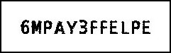

# Info

This script generate images of itunes card content code. (for readable OCR)

# Usage

**Important**: 
In order for this script to work you need to have [Imagemagick](https://www.imagemagick.org/script/index.php) installed.

Download promocodes.txt or copy the promocodes to clipboard from iTunesConnect and run `./icccig.sh promotions.txt` or `pbpaste | ./icccig.sh`. It will generate code images to `promocodes` directory.
